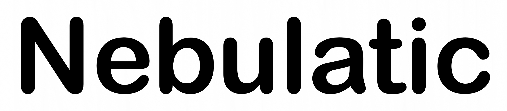

**<a href="https://github.com/xrg2014"><h1>Hola, I’m XRG2014</h1></a>**
- **I _LOOOOOOOOOOVE_ CATS**
  
  
- I’m interested in coding/shell scripting _(Or really anything tech related)_
- I'll probably just be posting random stuff that I coded, and whatever I code will probably be for either Linux or Windows
- I'm working with these people:
[@NebulaticOfficial](https://github.com/NebulaticOfficial)
[@gitventurer](https://github.com/gitventurer)

> _(Sorry if I spelled your names wrong)_

  
<!---
XRG2014/XRG2014 is a ✨ special ✨ repository because its `README.md` (this file) appears on your GitHub profile.
You can click the Preview link to take a look at your changes.
--->
